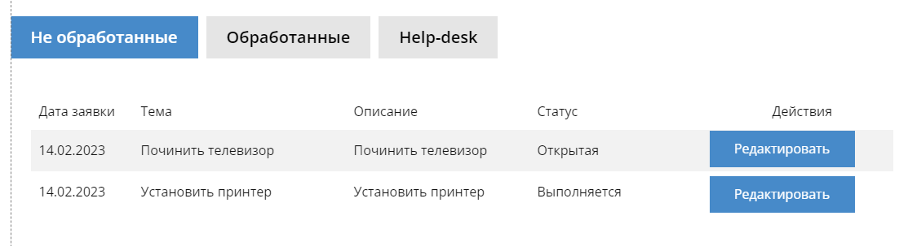
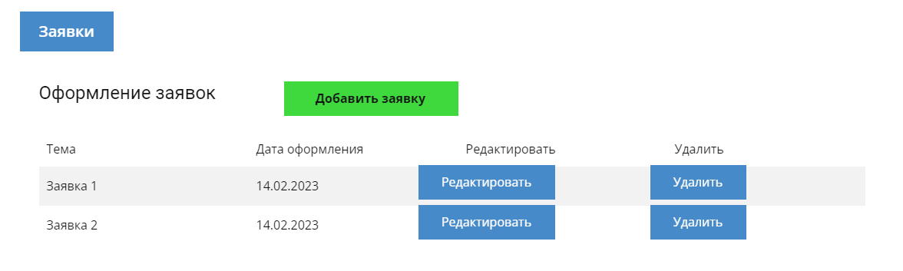

#Task Tracker

Учебный проект курса [Otus](https://otus.ru) [Kotlin Backend Developer](https://otus.ru/lessons/kotlin/).
Поток курса 2022-12.

Task Tracker -- не просто электронный журнал заявок, а самая критичная бизнес-система для сервисной компании.
Хороший способ управления запросами на обслуживание ориентирован на клиента, опирается на знания и оптимизирован благодаря автоматизации.
Применяя эти принципы во всех процессах, ваша организация может повысить эффективность команды поддержки, облегчить для клиентов обращение
за помощью и ее получение, а также использовать технологии, чтобы выдерживать ритм меняющихся потребностей компании.
Задача площадки -- получение заявок, расставление приоритетов заявок, отслеживание графика их выполнения и взаимодействие с клиентом

#Макет проекта
Приложение состоит из 3 профилей.

   1. Профиль администратора
   - добавление пользователей

   2. Профиль поставщика услуг 
   - отслеживание заявок
   - Распределение по категориям.
   - Установка ответственного и сроков выполнения
   - Изменять статус заявки
   
   
   3.Профиль заказчика  
   - оформление, редактирование, удаление заявки
   - отслеживание статуса заявки
   

## Документация

1. Маркетинг
    1. [Заинтересанты](./docs/01-marketing/01-stakeholders.md)
    2. [Целевая аудитория](./docs/01-marketing/02-target-audience.md)
    3. [Конкурентный анализ](./docs/01-marketing/03-concurrency.md)
    4. [Анализ экономики](./docs/01-marketing/04-economy.md)
    5. [Пользовательские истории](./docs/01-marketing/05-user-stories.md)

